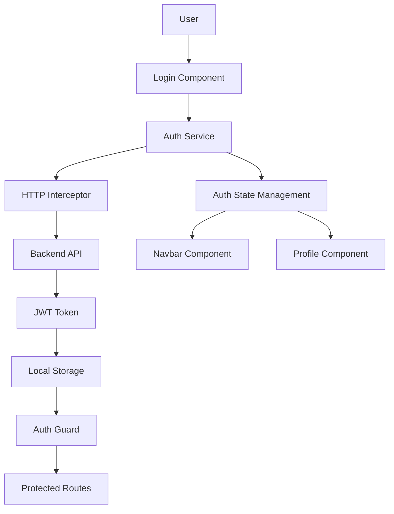

# Authentication System Design

## Overview

This design document outlines the comprehensive authentication system architecture for the Angular application. The system implements JWT-based authentication with user profile management, social login integration, and secure session handling. The design follows Angular best practices and provides a scalable, maintainable authentication solution.

## Architecture

### Authentication Flow Architecture



### Component Architecture

```typescript
// Core Authentication Architecture
interface AuthenticationSystem {
  services: {
    authService: AuthService;
    userService: UserService;
    tokenService: TokenService;
  };
  guards: {
    authGuard: AuthGuard;
    guestGuard: GuestGuard;
  };
  interceptors: {
    authInterceptor: AuthInterceptor;
    errorInterceptor: ErrorInterceptor;
  };
  components: {
    loginComponent: LoginComponent;
    registerComponent: RegisterComponent;
    profileComponent: ProfileComponent;
  };
}
```

## Components and Interfaces

### 1. Authentication Service

#### Core Authentication Service

```typescript
@Injectable({
  providedIn: "root",
})
export class AuthService {
  private currentUserSubject = new BehaviorSubject<User | null>(null);
  public currentUser$ = this.currentUserSubject.asObservable();

  private isAuthenticatedSubject = new BehaviorSubject<boolean>(false);
  public isAuthenticated$ = this.isAuthenticatedSubject.asObservable();

  constructor(private http: HttpClient, private router: Router, private tokenService: TokenService) {
    this.initializeAuth();
  }

  // Authentication methods
  login(credentials: LoginCredentials): Observable<AuthResponse>;
  register(userData: RegisterData): Observable<AuthResponse>;
  logout(): void;
  refreshToken(): Observable<AuthResponse>;

  // State management
  getCurrentUser(): User | null;
  isAuthenticated(): boolean;

  // Social authentication
  socialLogin(provider: string): Observable<AuthResponse>;
}
```

#### Token Management Service

```typescript
@Injectable({
  providedIn: "root",
})
export class TokenService {
  private readonly TOKEN_KEY = "auth_token";
  private readonly REFRESH_TOKEN_KEY = "refresh_token";
  private readonly USER_KEY = "current_user";

  // Token operations
  setToken(token: string): void;
  getToken(): string | null;
  removeToken(): void;

  // Token validation
  isTokenValid(): boolean;
  isTokenExpired(): boolean;
  getTokenExpirationDate(): Date | null;

  // User data
  setUser(user: User): void;
  getUser(): User | null;
  removeUser(): void;
}
```

### 2. User Profile Management

#### User Profile Component

```typescript
@Component({
  selector: "app-profile",
  templateUrl: "./profile.component.html",
  styleUrls: ["./profile.component.scss"],
})
export class ProfileComponent implements OnInit {
  profileForm: FormGroup;
  passwordForm: FormGroup;
  currentUser: User | null = null;
  isLoading = false;

  constructor(private fb: FormBuilder, private authService: AuthService, private userService: UserService) {
    this.initializeForms();
  }

  // Profile management methods
  updateProfile(): void;
  changePassword(): void;
  uploadAvatar(file: File): void;
  deleteAccount(): void;
}
```

#### User Service

```typescript
@Injectable({
  providedIn: "root",
})
export class UserService {
  constructor(private http: HttpClient) {}

  // User profile operations
  getProfile(): Observable<User>;
  updateProfile(userData: Partial<User>): Observable<User>;
  changePassword(passwordData: PasswordChangeData): Observable<void>;
  uploadAvatar(file: File): Observable<string>;
  deleteAccount(): Observable<void>;

  // User preferences
  getUserPreferences(): Observable<UserPreferences>;
  updatePreferences(preferences: UserPreferences): Observable<void>;
}
```

### 3. Navigation Guards

#### Authentication Guard

```typescript
@Injectable({
  providedIn: "root",
})
export class AuthGuard implements CanActivate, CanActivateChild {
  constructor(private authService: AuthService, private router: Router) {}

  canActivate(route: ActivatedRouteSnapshot, state: RouterStateSnapshot): Observable<boolean> | Promise<boolean> | boolean {
    return this.checkAuthentication(state.url);
  }

  canActivateChild(childRoute: ActivatedRouteSnapshot, state: RouterStateSnapshot): Observable<boolean> | Promise<boolean> | boolean {
    return this.canActivate(childRoute, state);
  }

  private checkAuthentication(url: string): Observable<boolean> {
    return this.authService.isAuthenticated$.pipe(
      map((isAuthenticated) => {
        if (isAuthenticated) {
          return true;
        } else {
          this.router.navigate(["/login"], { queryParams: { returnUrl: url } });
          return false;
        }
      })
    );
  }
}
```

#### Guest Guard (for login/register pages)

```typescript
@Injectable({
  providedIn: "root",
})
export class GuestGuard implements CanActivate {
  constructor(private authService: AuthService, private router: Router) {}

  canActivate(): Observable<boolean> {
    return this.authService.isAuthenticated$.pipe(
      map((isAuthenticated) => {
        if (!isAuthenticated) {
          return true;
        } else {
          this.router.navigate(["/dashboard"]);
          return false;
        }
      })
    );
  }
}
```

### 4. HTTP Interceptors

#### Authentication Interceptor

```typescript
@Injectable()
export class AuthInterceptor implements HttpInterceptor {
  constructor(private tokenService: TokenService) {}

  intercept(request: HttpRequest<any>, next: HttpHandler): Observable<HttpEvent<any>> {
    const token = this.tokenService.getToken();

    if (token && this.shouldAddToken(request)) {
      request = request.clone({
        setHeaders: {
          Authorization: `Bearer ${token}`,
        },
      });
    }

    return next.handle(request);
  }

  private shouldAddToken(request: HttpRequest<any>): boolean {
    // Add token to API requests but not to external URLs
    return request.url.includes("/api/");
  }
}
```

#### Error Interceptor

```typescript
@Injectable()
export class ErrorInterceptor implements HttpInterceptor {
  constructor(private authService: AuthService, private router: Router) {}

  intercept(request: HttpRequest<any>, next: HttpHandler): Observable<HttpEvent<any>> {
    return next.handle(request).pipe(
      catchError((error: HttpErrorResponse) => {
        if (error.status === 401) {
          // Unauthorized - token expired or invalid
          this.authService.logout();
          this.router.navigate(["/login"]);
        } else if (error.status === 403) {
          // Forbidden - insufficient permissions
          this.router.navigate(["/unauthorized"]);
        }

        return throwError(error);
      })
    );
  }
}
```

## Data Models

### User and Authentication Models

```typescript
// User model
export interface User {
  id: string;
  firstName: string;
  lastName: string;
  username: string;
  email: string;
  avatar?: string;
  role: UserRole;
  isActive: boolean;
  createdAt: Date;
  updatedAt: Date;
  preferences?: UserPreferences;
}

// Authentication models
export interface LoginCredentials {
  username: string;
  password: string;
  rememberMe?: boolean;
}

export interface RegisterData {
  firstName: string;
  lastName: string;
  username: string;
  email: string;
  password: string;
  confirmPassword: string;
}

export interface AuthResponse {
  user: User;
  token: string;
  refreshToken: string;
  expiresIn: number;
}

export interface PasswordChangeData {
  currentPassword: string;
  newPassword: string;
  confirmPassword: string;
}

// User preferences
export interface UserPreferences {
  theme: "light" | "dark";
  language: string;
  notifications: {
    email: boolean;
    push: boolean;
    sms: boolean;
  };
  privacy: {
    profileVisibility: "public" | "private";
    showEmail: boolean;
  };
}

// User roles
export enum UserRole {
  ADMIN = "admin",
  USER = "user",
  MODERATOR = "moderator",
}
```

### Form Validation Models

```typescript
// Validation patterns
export const ValidationPatterns = {
  email: /^[a-zA-Z0-9._%+-]+@[a-zA-Z0-9.-]+\.[a-zA-Z]{2,}$/,
  password: /^(?=.*[a-z])(?=.*[A-Z])(?=.*\d)(?=.*[@$!%*?&])[A-Za-z\d@$!%*?&]{8,}$/,
  username: /^[a-zA-Z0-9_]{3,20}$/,
  name: /^[a-zA-Z\s]{2,50}$/,
};

// Form validation messages
export const ValidationMessages = {
  required: "This field is required",
  email: "Please enter a valid email address",
  password: "Password must be at least 8 characters with uppercase, lowercase, number and special character",
  username: "Username must be 3-20 characters, letters, numbers and underscores only",
  name: "Name must be 2-50 characters, letters and spaces only",
  passwordMismatch: "Passwords do not match",
};
```

## Error Handling

### Authentication Error Handling

```typescript
// Error handling service
@Injectable({
  providedIn: "root",
})
export class ErrorHandlingService {
  handleAuthError(error: HttpErrorResponse): string {
    switch (error.status) {
      case 400:
        return this.handleValidationError(error);
      case 401:
        return "Invalid credentials. Please check your username and password.";
      case 403:
        return "Access denied. You do not have permission to perform this action.";
      case 404:
        return "User not found. Please check your credentials.";
      case 409:
        return "Username or email already exists. Please choose different credentials.";
      case 429:
        return "Too many login attempts. Please try again later.";
      case 500:
        return "Server error. Please try again later.";
      default:
        return "An unexpected error occurred. Please try again.";
    }
  }

  private handleValidationError(error: HttpErrorResponse): string {
    if (error.error && error.error.errors) {
      const firstError = Object.values(error.error.errors)[0];
      return Array.isArray(firstError) ? firstError[0] : firstError;
    }
    return "Please check your input and try again.";
  }
}
```

### Form Validation Error Handling

```typescript
// Custom validators
export class CustomValidators {
  static passwordMatch(control: AbstractControl): ValidationErrors | null {
    const password = control.get("password");
    const confirmPassword = control.get("confirmPassword");

    if (password && confirmPassword && password.value !== confirmPassword.value) {
      return { passwordMismatch: true };
    }
    return null;
  }

  static strongPassword(control: AbstractControl): ValidationErrors | null {
    const value = control.value;
    if (!value) return null;

    const hasUpperCase = /[A-Z]/.test(value);
    const hasLowerCase = /[a-z]/.test(value);
    const hasNumeric = /[0-9]/.test(value);
    const hasSpecialChar = /[!@#$%^&*()_+\-=\[\]{};':"\\|,.<>\/?]/.test(value);
    const isValidLength = value.length >= 8;

    const valid = hasUpperCase && hasLowerCase && hasNumeric && hasSpecialChar && isValidLength;

    if (!valid) {
      return { strongPassword: true };
    }
    return null;
  }
}
```

## Testing Strategy

### Unit Testing Approach

```typescript
// Auth service testing
describe("AuthService", () => {
  let service: AuthService;
  let httpMock: HttpTestingController;
  let tokenService: jasmine.SpyObj<TokenService>;

  beforeEach(() => {
    const tokenServiceSpy = jasmine.createSpyObj("TokenService", ["setToken", "getToken", "removeToken", "isTokenValid"]);

    TestBed.configureTestingModule({
      imports: [HttpClientTestingModule],
      providers: [AuthService, { provide: TokenService, useValue: tokenServiceSpy }],
    });

    service = TestBed.inject(AuthService);
    httpMock = TestBed.inject(HttpTestingController);
    tokenService = TestBed.inject(TokenService) as jasmine.SpyObj<TokenService>;
  });

  it("should login user successfully", () => {
    const mockCredentials: LoginCredentials = {
      username: "testuser",
      password: "password123",
    };

    const mockResponse: AuthResponse = {
      user: mockUser,
      token: "mock-token",
      refreshToken: "mock-refresh-token",
      expiresIn: 3600,
    };

    service.login(mockCredentials).subscribe((response) => {
      expect(response).toEqual(mockResponse);
      expect(tokenService.setToken).toHaveBeenCalledWith("mock-token");
    });

    const req = httpMock.expectOne("/api/auth/login");
    expect(req.request.method).toBe("POST");
    req.flush(mockResponse);
  });
});
```

### Integration Testing

```typescript
// Component integration testing
describe("LoginComponent Integration", () => {
  let component: LoginComponent;
  let fixture: ComponentFixture<LoginComponent>;
  let authService: jasmine.SpyObj<AuthService>;

  beforeEach(() => {
    const authServiceSpy = jasmine.createSpyObj("AuthService", ["login"]);

    TestBed.configureTestingModule({
      declarations: [LoginComponent],
      imports: [ReactiveFormsModule, RouterTestingModule],
      providers: [{ provide: AuthService, useValue: authServiceSpy }],
    });

    fixture = TestBed.createComponent(LoginComponent);
    component = fixture.componentInstance;
    authService = TestBed.inject(AuthService) as jasmine.SpyObj<AuthService>;
  });

  it("should submit login form with valid data", () => {
    const mockResponse: AuthResponse = {
      user: mockUser,
      token: "mock-token",
      refreshToken: "mock-refresh-token",
      expiresIn: 3600,
    };

    authService.login.and.returnValue(of(mockResponse));

    component.loginForm.patchValue({
      username: "testuser",
      password: "password123",
    });

    component.onSubmit();

    expect(authService.login).toHaveBeenCalledWith({
      username: "testuser",
      password: "password123",
      rememberMe: false,
    });
  });
});
```

## Security Considerations

### JWT Token Security

```typescript
// Secure token storage
export class SecureTokenService {
  private readonly TOKEN_KEY = "auth_token";

  setToken(token: string): void {
    // Use secure storage for sensitive data
    if (this.isSecureContext()) {
      // Use secure storage mechanisms
      sessionStorage.setItem(this.TOKEN_KEY, token);
    } else {
      // Fallback for non-secure contexts
      localStorage.setItem(this.TOKEN_KEY, token);
    }
  }

  private isSecureContext(): boolean {
    return window.isSecureContext && "crypto" in window;
  }

  // Token validation
  validateToken(token: string): boolean {
    try {
      const payload = JSON.parse(atob(token.split(".")[1]));
      const currentTime = Math.floor(Date.now() / 1000);
      return payload.exp > currentTime;
    } catch {
      return false;
    }
  }
}
```

### CSRF Protection

```typescript
// CSRF token handling
@Injectable()
export class CsrfInterceptor implements HttpInterceptor {
  intercept(req: HttpRequest<any>, next: HttpHandler): Observable<HttpEvent<any>> {
    if (req.method === "POST" || req.method === "PUT" || req.method === "DELETE") {
      const csrfToken = this.getCsrfToken();
      if (csrfToken) {
        req = req.clone({
          setHeaders: {
            "X-CSRF-TOKEN": csrfToken,
          },
        });
      }
    }
    return next.handle(req);
  }

  private getCsrfToken(): string | null {
    return document.querySelector('meta[name="csrf-token"]')?.getAttribute("content") || null;
  }
}
```

## Performance Optimization

### Lazy Loading and Code Splitting

```typescript
// Feature module lazy loading
const routes: Routes = [
  {
    path: "auth",
    loadChildren: () => import("./auth/auth.module").then((m) => m.AuthModule),
    canActivate: [GuestGuard],
  },
  {
    path: "profile",
    loadChildren: () => import("./profile/profile.module").then((m) => m.ProfileModule),
    canActivate: [AuthGuard],
  },
];
```

### Caching Strategy

```typescript
// User data caching
@Injectable({
  providedIn: "root",
})
export class UserCacheService {
  private cache = new Map<string, { data: any; timestamp: number }>();
  private readonly CACHE_DURATION = 5 * 60 * 1000; // 5 minutes

  get<T>(key: string): T | null {
    const cached = this.cache.get(key);
    if (cached && Date.now() - cached.timestamp < this.CACHE_DURATION) {
      return cached.data;
    }
    this.cache.delete(key);
    return null;
  }

  set<T>(key: string, data: T): void {
    this.cache.set(key, { data, timestamp: Date.now() });
  }

  clear(): void {
    this.cache.clear();
  }
}
```

This comprehensive authentication system design provides a secure, scalable, and maintainable solution that integrates seamlessly with the existing Angular application while following best practices for security, performance, and user experience.
